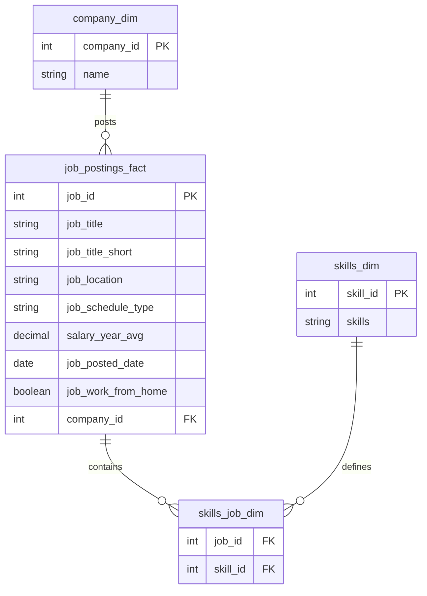
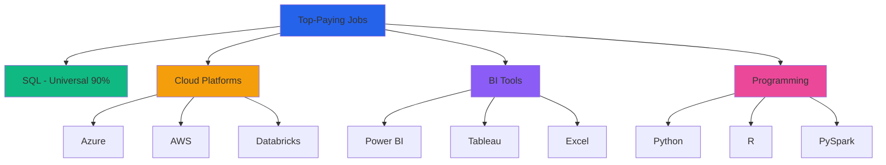
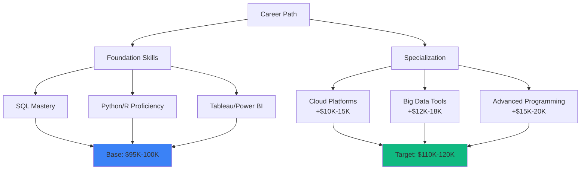

# 📊 Data Analyst Job Market Analysis

A comprehensive SQL project analyzing the data analyst job market, focusing on top-paying roles, in-demand skills, and optimal career development strategies for remote positions.


---

## 🎯 Project Overview

This project explores the data analyst job market through SQL queries, answering critical questions about:
- **Top-paying remote data analyst positions**
- **Skills required for high-salary roles**
- **Most in-demand skills across the market**
- **Skills associated with highest salaries**
- **Optimal skills balancing demand and compensation**

The analysis provides actionable insights for data analysts looking to maximize their career potential and earning opportunities.

---

## 📁 Project Structure

```
📦 SQL-Job-Analysis
 ┣ 📜 1_top_paying_jobs.sql
 ┣ 📜 2_top_paying_jobs_skills.sql
 ┣ 📜 3_top_demanded_skills.sql
 ┣ 📜 4_top_paying_skills.sql
 ┗ 📜 5_optimal_skills.sql
```

---

## 🗄️ Database Schema

The analysis is built on three main tables with the following relationships:



---

## 🔍 Analysis Breakdown

### 1️⃣ Top-Paying Data Analyst Jobs

**Query:** `1_top_paying_jobs.sql`

Identifies the top 10 highest-paying remote Data Analyst positions with specified salaries.

**Key Findings:**
- Salary range: **$184K - $256K** annually
- All positions are **100% remote** (location: "Anywhere")
- Focuses on roles with transparent compensation

**SQL Highlights:**
```sql
SELECT job_id, job_title, job_location, salary_year_avg, name AS company_name
FROM job_postings_fact
LEFT JOIN company_dim ON company_dim.company_id = job_postings_fact.company_id
WHERE job_title_short = 'Data Analyst' 
  AND job_location = 'Anywhere' 
  AND salary_year_avg IS NOT NULL
ORDER BY salary_year_avg DESC
LIMIT 10;
```

---

### 2️⃣ Skills for Top-Paying Roles

**Query:** `2_top_paying_jobs_skills.sql`

Analyzes the specific skills required for the highest-paying data analyst positions.

**Key Insights:**



**Critical Skills Pattern:**
- **SQL** remains the foundation (90% of top roles)
- **Cloud transition** → Azure, AWS, Databricks dominate
- **BI Integration** → Power BI + Tableau essential
- **ETL Evolution** → Modern data lake integration required

---

### 3️⃣ Most In-Demand Skills

**Query:** `3_top_demanded_skills.sql`

Determines the top 5 most frequently requested skills across all Data Analyst job postings.

**Analysis:**
```sql
SELECT skills, COUNT(skills_job_dim.job_id) AS demanded_skills
FROM job_postings_fact
INNER JOIN skills_job_dim ON job_postings_fact.job_id = skills_job_dim.job_id
INNER JOIN skills_dim ON skills_dim.skill_id = skills_job_dim.skill_id
WHERE job_title_short = 'Data Analyst'
GROUP BY skills
ORDER BY demanded_skills DESC
LIMIT 5;
```

---

### 4️⃣ Top-Paying Skills

**Query:** `4_top_paying_skills.sql`

Identifies skills associated with the highest average salaries for remote Data Analyst positions.

**Methodology:**
- Filters for remote work positions (`job_work_from_home = TRUE`)
- Calculates average salary by skill
- Returns top 25 highest-paying skills

**Salary Range:** Skills commanding premium compensation tend to be specialized technologies and emerging platforms.

---

### 5️⃣ Optimal Skills Analysis

**Query:** `5_optimal_skills.sql`

**🎯 The Most Strategic Query** - Identifies skills that offer both high demand AND high salaries, providing the best ROI for career development.

**Methodology:**


**Top Optimal Skills (2023 Data):**

| Skill | Demand Count | Avg Salary | Category |
|-------|--------------|------------|----------|
| **Go** | 27 | $115,320 | Programming |
| **Confluence** | 11 | $114,210 | Collaboration |
| **Hadoop** | 22 | $113,193 | Big Data |
| **Snowflake** | 37 | $112,948 | Cloud Data |
| **Azure** | 34 | $111,225 | Cloud Platform |
| **BigQuery** | 13 | $109,654 | Cloud Data |
| **AWS** | 32 | $108,317 | Cloud Platform |
| **Python** | 236 | $101,397 | Programming |
| **R** | 148 | $100,499 | Programming |
| **Tableau** | 230 | $99,288 | Visualization |

**Strategic Insights:**

1. **High-Demand Programming Languages**
   - Python and R show massive demand (236 and 148 jobs)
   - Salaries around $100K-101K indicate these are foundational skills
   - High availability of professionals keeps salaries stable

2. **Cloud Technologies Premium**
   - Snowflake, Azure, AWS, BigQuery command $108K-$113K
   - Growing importance of cloud platforms and big data
   - Specialized skills yield higher compensation

3. **Business Intelligence Critical**
   - Tableau (230 demand) and Looker (49 demand)
   - Average salaries: $99K-$104K
   - Data visualization remains essential for actionable insights

4. **Database Expertise Valuable**
   - Oracle, SQL Server, NoSQL range from $98K-$105K
   - Enduring need for data storage and management
   - Both traditional and modern databases in demand

---

## 💡 Key Takeaways

### 🎓 For Career Development

1. **Foundation First**: Master SQL (universal requirement)
2. **Cloud is King**: Invest in Azure, AWS, or Snowflake certifications
3. **Visualization Matters**: Tableau and Power BI are non-negotiable
4. **Programming Power**: Python proficiency is your multiplier
5. **Specialize Strategically**: Niche skills (Go, Hadoop) command premium pay

### 💰 Salary Optimization Strategy



---

## 🚀 Getting Started

### Prerequisites
- PostgreSQL or any SQL database
- Dataset with job postings, skills, and company information

### Running the Queries

1. **Clone or download** the SQL files
2. **Import** your job market dataset
3. **Execute queries** in order (1-5) for complete analysis
4. **Customize** filters for your specific market or role

### Query Execution Order
```bash
1_top_paying_jobs.sql          # Baseline compensation insights
2_top_paying_jobs_skills.sql   # Skill requirements for top tier
3_top_demanded_skills.sql      # Market demand overview
4_top_paying_skills.sql        # Premium skill identification
5_optimal_skills.sql           # Strategic skill selection
```

---

## 📊 Analysis Techniques Used

- **Aggregation Functions**: `COUNT()`, `AVG()`, `ROUND()`
- **Joins**: `INNER JOIN`, `LEFT JOIN` for relational analysis
- **Filtering**: `WHERE`, `HAVING` clauses for data refinement
- **CTEs**: `WITH` clauses for complex query organization
- **Ranking**: `ORDER BY`, `LIMIT` for top-N analysis
- **Grouping**: `GROUP BY` for categorical aggregation

---

## 🎯 Business Applications

This analysis can be used by:

- **Job Seekers**: Identify which skills to prioritize for maximum career impact
- **Employers**: Understand competitive compensation and required skill sets
- **Training Providers**: Design curriculum based on market demands
- **Career Counselors**: Provide data-driven guidance to aspiring data analysts
- **Recruiters**: Benchmark salaries and skill requirements

---

## 📈 Future Enhancements

- [ ] Time-series analysis of skill demand trends
- [ ] Geographic salary comparisons
- [ ] Industry-specific skill requirements
- [ ] Experience level vs. compensation correlation
- [ ] Skill combination optimization (multi-skill analysis)
- [ ] Job title hierarchy and progression paths

---

## 🤝 Contributing

Contributions, issues, and feature requests are welcome! Feel free to:
- Add new analytical queries
- Improve existing query performance
- Suggest additional insights
- Update documentation

---

## 📝 License

This project is open source and available for educational and commercial use.

---

## 👤 Author

**Mohamed Tamer Nassr**
- Analysis Period: 2023 Job Market Data
- Focus: Remote Data Analyst Positions
- Geography: United States Market

---

## 🙏 Acknowledgments

- Data sourced from comprehensive job market datasets
- Analysis methodology based on industry best practices
- Inspired by data-driven career development principles

---

<div align="center">

**⭐ Star this repository if you find it helpful!**

Made with ❤️ and SQL

</div>
